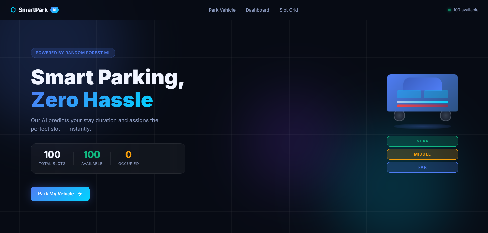
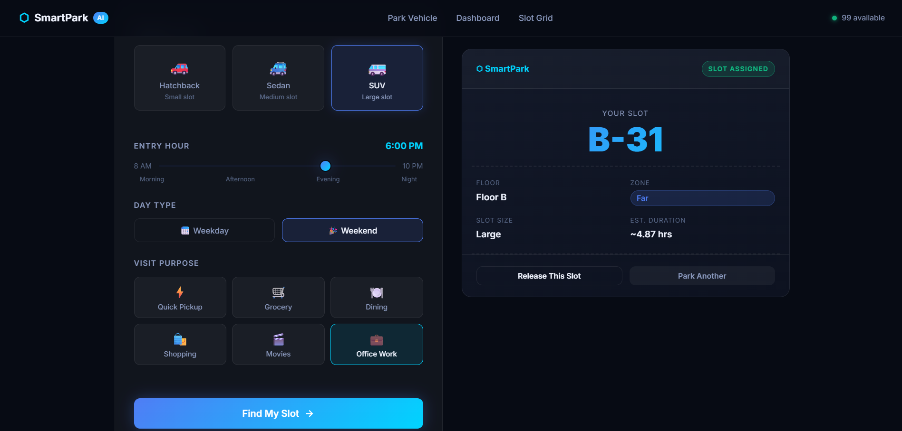
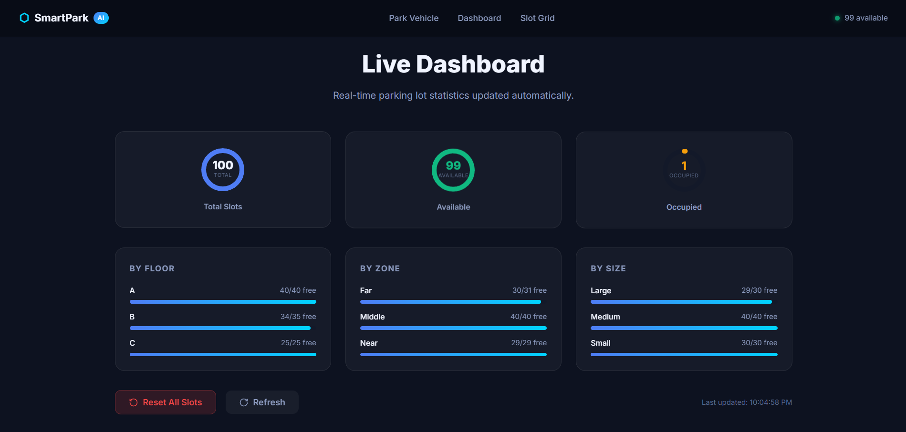
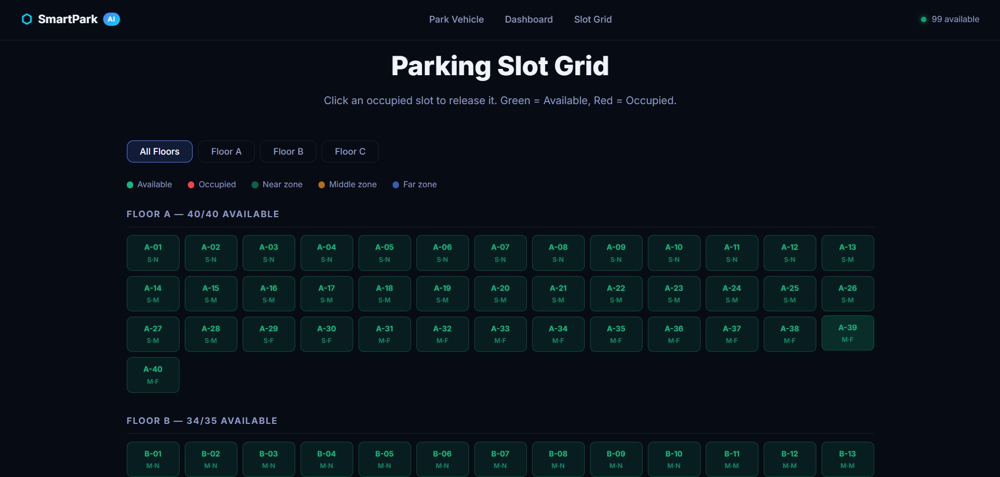
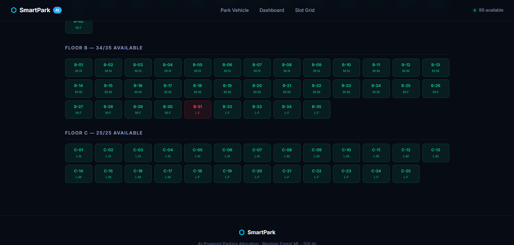

# SmartPark AI – Intelligent Parking Allocation System

> Smart parking system powered by machine learning for dynamic slot allocation and real-time monitoring.

---

## Overview

SmartPark AI is a machine learning-driven parking management system designed to optimize parking space utilization in commercial environments.

The system predicts vehicle dwell time using inputs such as vehicle type, arrival time, and visit purpose, and dynamically allocates parking slots to reduce congestion and improve efficiency.

---

## Academic Project Title

A Machine Learning-Based System for Predictive, Vehicle-Type Aware Dynamic Allocation of Parking Spaces in Commercial Complexes

---

## Demo

### Landing Page



### Vehicle Input & Selection



### Slot Assignment Result



### Live Dashboard



### Parking Slot Grid



---

## Problem Statement

Traditional parking systems rely on static allocation strategies, which often result in:

* Inefficient utilization of parking space
* Increased congestion and waiting time
* Lack of predictive insights

SmartPark AI addresses these issues using a data-driven, predictive allocation approach.

---

## System Architecture

The system follows a modular architecture consisting of five main components:

* **User Interface (Frontend):** Captures user input such as vehicle type, arrival time, and visit purpose
* **Flask Backend (app.py):** Handles requests and coordinates system operations
* **Machine Learning Model (Random Forest):** Predicts parking duration based on input features
* **Allocation Engine:** Assigns optimal parking slots based on predicted duration and constraints
* **SQLite Database:** Stores parking slot availability and updates in real time

---

## System Workflow

1. User provides vehicle details through the interface
2. Backend processes input and sends data to the ML model
3. ML model predicts parking duration
4. Allocation engine selects the most suitable parking slot
5. Database updates slot availability dynamically
6. Result is displayed to the user and reflected in the dashboard

---

## Tech Stack

* Python
* Flask
* SQLite
* Scikit-learn
* HTML, CSS

---

## Model Details

* **Algorithm:** Random Forest Regressor
* **Objective:** Predict parking duration
* **Evaluation Metric:** Mean Absolute Error ≈ 0.39 hours

### Features Used

* Vehicle Type
* Arrival Time
* Visit Purpose

---

## Design Decisions

* Used machine learning instead of rule-based logic to handle variability in parking behavior
* Implemented modular architecture separating ML, allocation logic, and database layers
* Chose SQLite for lightweight and efficient data management
* Designed zone-based allocation strategy to improve parking efficiency and user convenience

---

## Key Features

* Predictive parking duration using ML
* Intelligent slot allocation
* Real-time database updates
* Optimized allocation logic
* Modular and scalable system design

---

## Repository Structure

```
.
├── app.py
├── parking_engine.py
├── allocate_slot.py
├── generate_dataset.py
├── generate_slots.py
├── train_model.py
├── setup_database.py
├── reset_database.py
├── view_database.py
├── parking_model.pkl
├── parking_system.db
├── parking_slots_dataset.csv
├── synthetic_parking_dataset.csv
├── static/
├── assets/
├── requirements.txt
```

---

## How to Run

```bash
pip install -r requirements.txt
python setup_database.py
python generate_dataset.py
python train_model.py
python app.py
```

---

## Future Enhancements

* Integration with real-time IoT sensors
* Cloud deployment (AWS / GCP)
* Analytics dashboard
* Improved model accuracy using real-world datasets

---

## Contact

[eng23cs0367@dsu.edu.in](mailto:eng23cs0367@dsu.edu.in)
